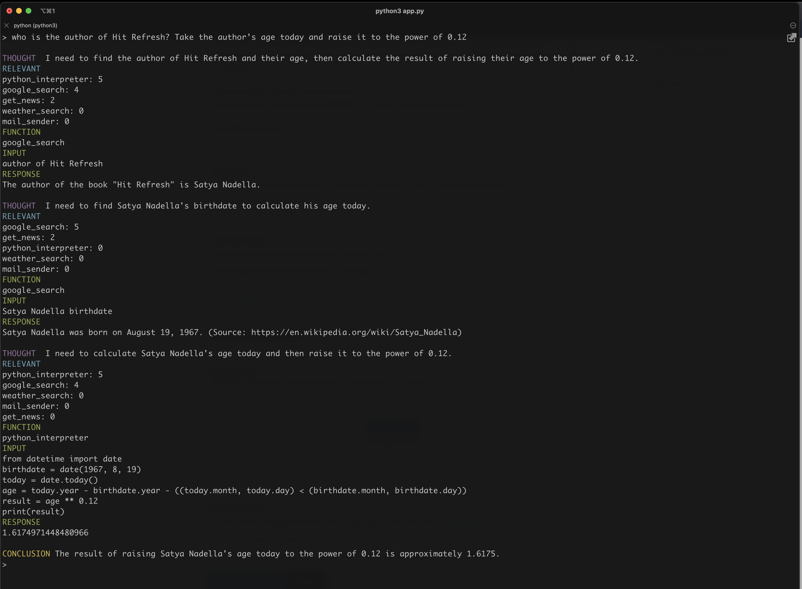

# CoT

- GPT as CPU
- Context window as RAM
- Chain-of-Thought as call stack
- USE CASE as of 07/15/2023: **Govern Code Repo**

# Install

Create new virtual environment called venv by

```
python -m venv venv
```

On Macos, enter this new venv by

```
source venv/Scripts/activate
```

On Windows, enter by

```
venv\Scripts\activate
```

Then run

```
pip install -r requirements.txt
```

You also need to create a file called `config.py` under the same directory as `requirements.txt` that contians the following content:

```
import os
os.environ['OPENAI_API_KEY'] = '<YOUR_OPENAI_API_KEY>'
```

Swap out that place with your openai api. You can now run this project with

```
python app.py
```

Run the following to see what it does

```
> days since elon musk bought twitter?
```

# Sample Queries / Natural Language CMD

- `Create *this* piece of software w python and streamlit and tell me how to run in README`
- `This repo that I have here, what is it about? What does *some component* does in it?`
- `Build this app I've describbed in this .txt file (or here in cmd) and deploy it on port 80`
- `[When have image modality] This project of mine, make home page looks more like this (some drawings)`

# Mock CoT

##### Using the BostonHousing.csv file, Create a Streamlit app that shows plots of each column with respect to 'medv'. Run it and show me on localhost.

- THOUGHT: `I will create a script for this app named app.py`
- COMMAND: `touch app.py`
- RESPONSE:
- THOUGHT: `I will now write the code into this file. First, I will open it`
- COMMAND: `vi app.py`
- RESPONSE: `* empty vi interface *`
- COMMAND:

  ```
  import streamlit as st
  import pandas as pd
  import matplotlib.pyplot as plt
  import seaborn as sns

  # Set the title of the app
  st.title('Boston Housing Data Exploration')

  # Load the BostonHousing.csv dataset
  @st.cache
  def load_data():
      df = pd.read_csv('BostonHousing.csv')
      return df

  df = load_data()

  # Get all the columns in the DataFrame
  columns = df.columns.tolist()

  # Remove 'medv' from the list
  columns.remove('medv')

  # Iterate over the DataFrame columns
  for col in columns:
      st.markdown(f'## {col} vs medv')

      fig, ax = plt.subplots()
      ax = sns.scatterplot(x=col, y='medv', data=df)
      st.pyplot(fig)

  ```

- RESPONSE:
- THOUGHT: `I will now save and quit the code`
- COMMAND: `:wq`
- RESPONSE:
- THOUGHT: `I will now create a requirement.txt`
- ...
- THOUGHT: `I will now run it locally.`
- COMMAND: `streamlit run app.py`
- RESPONSE: `streamlit app running on localhost:6001...`
- CONCLUSION: `I have done what you asked. The app is running on localhost:6001`

##### This project under directory (the app we just created), what does it do? `> cd --> > ls --> > vi --> > conclusion`

##### This project under directory (some big code base), what does it do? `> cd --> > ls --> > vi --> > goto def "some_function()" ... --> conclusion`

## Example 1

```bash
> reverse sort the content in the requirements.txt file in alphabetical order.

COMMAND
sort -r requirements.txt
RESPONSE
openai
langchain
google-api-python-client
colorlog
chromadb


CONCLUSION The content of the requirements.txt file has been successfully sorted in reverse alphabetical order. Is there anything else you need help with?
> the file insnt updated, can you do the reverse sort and update the file?
COMMAND
sort -r requirements.txt -o requirements.txt
RESPONSE


CONCLUSION The requirements.txt file has been successfully sorted in reverse alphabetical order and updated. Can I assist you with anything else?
```

## Example 2

```bash
> create a new directory called new_project in the current location

COMMAND
mkdir new_project
RESPONSE


CONCLUSION The directory "new_project" has been created in the current location. Would you like to perform any other operations?
> go into the new_project directory
COMMAND
cd new_project
RESPONSE


CONCLUSION You are now in the "new_project" directory. What would you like to do next?
> create a new file named readme.txt in this directory, and write pi to the 10th digit in it.
COMMAND
echo "3.1415926535" > readme.txt
RESPONSE


CONCLUSION The file "readme.txt" has been created in the "new_project" directory with pi to the 10th digit written in it. Would you like to perform any other operations?
```

## Example 3

```bash
> display the list of files in the current directory

COMMAND
ls
RESPONSE
README.md
__pycache__
app.py
chains
chroma
chroma.py
config.py
functions
indices
new_project
readme.txt
requirements.txt
test.txt
utils
venv


CONCLUSION Here is the list of files in your current directory. Is there anything else you need help with?
> move test.txt into the new_project directory
COMMAND
mv test.txt new_project
RESPONSE


CONCLUSION The file 'test.txt' has been moved to the 'new_project' directory. Would you like to perform any other operations?
> list all the files in the new project dir
COMMAND
ls new_project
RESPONSE
test.txt


CONCLUSION The 'new_project' directory contains the file 'test.txt'. Is there anything else you would like to do?
```

## Example 4

````bash
> count the number of lines in the README.md file
COMMAND
wc -l README.md
RESPONSE
     227 README.md


CONCLUSION The README.md file contains 227 lines. Is there anything else you would like to do with this file or any other task you need assistance with?
> show the first 10 lines and last 10 lines in that file
COMMAND
head -10 README.md && tail -10 README.md
RESPONSE
# CoT Hackathon Project
* GPT as CPU
* Context window as RAM
* Chain-of-Thought as call stack
* USE CASE as of 07/15/2023: **Govern Code Repo**
# Install
Create new virtual environment called venv by
CONCLUSION The "data.csv" file has 1000 lines. How can I assist you further?
> only show the first 10 lines of data.csv.
COMMAND
head -n 10 data.csv
RESPONSE
(column data)

CONCLUSION Here are the first 10 lines of "data.csv". What would you like to do next?```

CONCLUSION Here are the first 10 and last 10 lines of the README.md file. If you need to perform any other operations on this file or any other file, please let me know.
````
